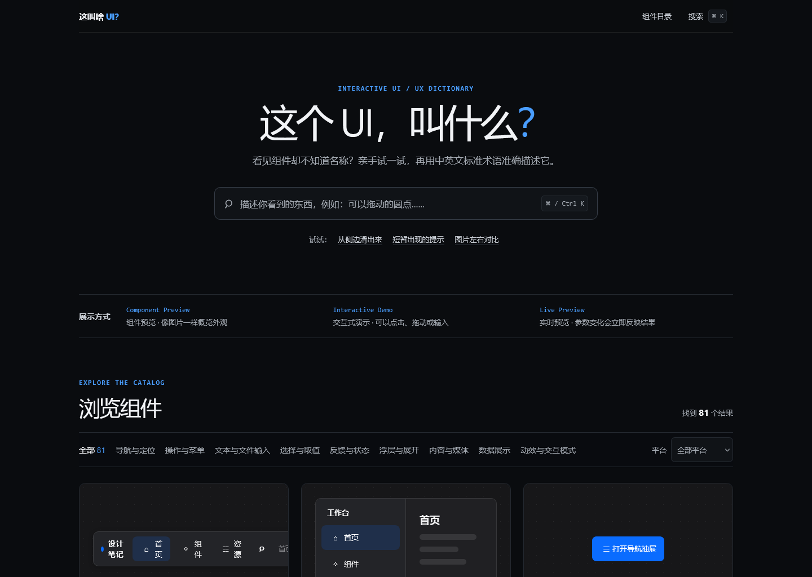
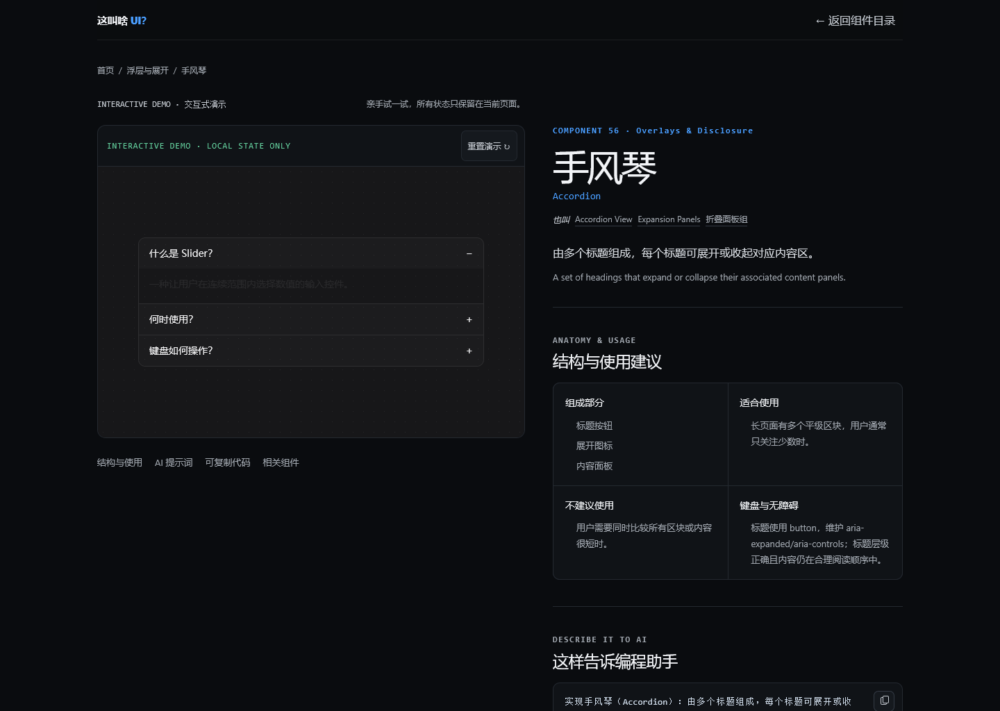

<div align="center">

# 这叫啥 UI？

**What UI Is This? — 一份可以看图识别、用网址分析，也可以亲手试玩的中英双语 UI / UX 视觉词典。**

当你知道一个界面“长什么样、怎么操作”，却不知道它叫什么时，上传截图、框选区域，或提供公开网页地址。

[在线体验](https://what-ui-guide.reasonw6.chatgpt.site) · [浏览全部组件](https://what-ui-guide.reasonw6.chatgpt.site/#catalog) · [GitHub](https://github.com/ReasonW6/what-ui-guide)


</div>



## 它解决什么问题？

UI / UX 术语往往比界面本身更难找。你可能知道“右键后出现一组操作”“可以拖动的圆点”“从侧边滑出来的面板”，却不知道该搜索 `Context Menu`、`Slider` 还是 `Navigation Drawer`。

“这叫啥 UI？”把抽象术语变成可操作的视觉索引：

- 上传截图并框选真正想问的区域，减少页面其他元素对识别的干扰。
- 首页保持词典原有布局；只有点击导航栏“AI 识别”后才打开独立浮层，关闭后焦点返回触发按钮。
- 输入公开网页 URL；满足安全白名单时读取浏览器快照，否则使用受限的公开网页语义检索。
- 获得 1–3 个候选术语，以及证据、置信度、不确定性、易混项和后续追问。
- 直接在目录卡片中点击、输入、拖动或展开，确认它是不是你想找的组件。
- 同时查看中文名称、英文标准术语、实现结构、行为、样式、无障碍建议和可复制代码。

> 这是组件视觉词典与教学演示，不是可安装的生产级 UI 组件库。

## 主要能力

| 能力 | 说明 |
| --- | --- |
| 截图与区域识别 | 支持上传、拖放或粘贴截图，并用百分比坐标框选区域；分析前在浏览器中裁剪，不必把整张页面都交给模型。 |
| 多服务商 BYOK | 内置 OpenAI、Anthropic、Kimi、硅基流动、OpenRouter、Gemini 与 xAI 等预设，也支持自定义兼容 API 和模型。 |
| 本地凭据保险库 | Key 默认只保留在当前页面内存；用户主动选择后，使用 Web Crypto 加密并写入同源 IndexedDB。 |
| 公开网页分析 | 对安全白名单内的网页优先使用浏览器快照；未配置快照能力时退化为按目标域名限制的公开网页语义分析。 |
| 可解释候选结果 | 返回 1–3 个目录内候选，逐项说明视觉或行为证据、区别点、置信度、不确定性与必要的后续问题。 |
| 实现工作台 | 选中候选后可继续查看交互演示、易混术语、结构 / 行为 / 样式 / 无障碍指导，以及原生与 React 代码。 |
| 自然语言搜索 | 匹配中文名、英文名、别名、关键词、组成结构、使用建议、分类与平台；支持“可以拖动的圆点”等描述。 |
| 81 个交互条目 | 9 个分类，覆盖导航、菜单、输入、选择、反馈、浮层、内容、数据和交互模式。 |
| 三层展示语言 | `Component Preview` 用于识别外观，`Interactive Demo` 用于亲手操作，`Live Preview` 用于观察参数变化。 |
| 独立详情页 | 每个组件都有定义、别名、完整演示、重置、结构、使用建议、键盘说明、易混术语与相关组件。 |
| 两套代码示例 | 提供原生 `HTML / CSS / JS` 与 `React / CSS` 最小示例，各文件可单独复制。 |
| AI 描述提示词 | 为每个术语提供简短、聚焦的实现描述，方便粘贴给编程助手。 |
| URL 可恢复筛选 | 搜索、分类和平台状态同步到查询参数，刷新或分享后仍可恢复。 |
| 响应式与键盘友好 | 从 320px 到宽屏自适应，并为菜单、Tabs、Grid、Tree、Slider、弹层和拖放等提供键盘路径。 |

## AI 识别浮层

识别不是只返回一个可能错误的名字，而是围绕“为什么像、还可能是什么、下一步怎么实现”组织结果：

1. **截图路径**：上传、拖放或粘贴 `PNG / JPEG / WebP / GIF`，框选组件区域，也可分析整图。
2. **网页路径**：输入公开的 `https://` 地址。只有配置在 `BROWSER_ALLOWED_HOSTS` 中的精确主机名可以进入浏览器快照流程；其他公共网页使用限定域名的语义检索，不会由服务器直接抓取任意 HTML。
3. **候选判断**：模型只能从本项目目录 slug 中选择候选，并返回识别状态、证据、区别、不确定性与追问；无法可靠识别时会明确给出 `unknown`，而不是硬猜。
4. **落地实现**：候选会重新关联到本地可信目录数据，展示真实演示、易混术语、实现指导与两套代码示例，而不是采用模型生成的未知代码。

截图、URL、识别结果和历史记录不会写入本站数据库。OpenAI Responses 请求设置 `store: false`。如果部署方没有配置托管 OpenAI Key，或用户选择了其他服务商，界面会要求 BYOK。Key 默认只保存在当前页面内存，关闭识别浮层后仍可继续使用，刷新页面即清除。

用户也可以主动勾选“在此浏览器加密保存”：浏览器会为凭据生成不可导出的 AES-256-GCM `CryptoKey`，使用独立随机 IV 加密完整配置，再把密钥对象和密文保存到本站来源的 IndexedDB。浏览器同源策略阻止其他网站直接读取这份存储；应用写入 IndexedDB 的凭据 payload 不含明文 API Key，加密密钥由浏览器以不可导出 `CryptoKey` 管理。清除本地配置会删除该记录。

这是一层本地静态防护，不是密码管理器。本站同源 XSS、被攻陷的同源脚本、恶意浏览器扩展、DevTools、受控浏览器或系统恶意软件仍可能在解密后取得 Key，或直接代用户发起请求。每次识别时，Key 都会临时经过本站 Worker，再发送给所选 AI 服务商；应用代码不主动把它写入日志或云端存储。若安全要求更高，请保持默认的会话模式，并使用限额、可撤销的专用 Key。

> AI 结果是辅助判断，不是确定性的 DOM 检查器。登录态、内网或需要交互后才出现的页面请改用截图；不要上传包含密钥、身份信息或其他敏感数据的画面。

### 支持的 AI 服务

| 预设 | 默认模型 | 接口适配 | 图片识别 |
| --- | --- | --- | --- |
| OpenAI | `gpt-5.6-sol` | Responses | 支持；也可对公开网页做限定域名检索 |
| Anthropic | `claude-sonnet-5` | Messages | 支持 |
| Kimi 中国 / Global | `kimi-k2.6` | OpenAI Chat | 支持 |
| 硅基流动 | `zai-org/GLM-4.5V` | OpenAI Chat | 取决于控制台当前可用视觉模型 |
| OpenRouter | `google/gemini-3.5-flash` | OpenAI Chat | 取决于所选路由模型 |
| Google Gemini | `gemini-3.5-flash` | OpenAI Chat 兼容层 | 支持 |
| xAI | `grok-4.5` | OpenAI Chat | 支持 |
| 自定义 API | 用户填写 | OpenAI Chat / Responses / Anthropic Messages | 取决于目标模型 |

模型供应会变化，所以所有模型名都可以在设置中修改。内置预设使用服务端固定的规范地址，浏览器不能覆盖；自定义地址只接受公开 HTTPS 域名，不允许用户名密码、查询参数、显式端口、IP 或内网主机，也不跟随重定向。填写站点根地址时会补全 `/v1`，填写已有路径时会保留，并在发送前展示最终请求地址。自定义接口仍只会收到固定的识别请求结构，不支持任意请求头或任意代理内容。主机名字符串校验无法彻底消除 DNS 重绑定风险；高安全部署应在平台出口层使用域名白名单，或禁用自定义端点。

除 OpenAI 的受限网页检索外，其他服务商只有在目标域名已配置受控浏览器快照时才能分析网址；否则界面会要求改用截图。协议和视觉能力依据各服务商文档实现：[OpenAI](https://developers.openai.com/api/docs/guides/images-vision)、[Anthropic](https://platform.claude.com/docs/en/build-with-claude/vision)、[Kimi](https://platform.kimi.com/docs/guide/use-kimi-vision-model)、[SiliconFlow](https://docs.siliconflow.cn/cn/userguide/capabilities/multimodal-vision)、[OpenRouter](https://openrouter.ai/docs/guides/overview/multimodal/image-understanding)、[Gemini](https://ai.google.dev/gemini-api/docs/openai) 与 [xAI](https://docs.x.ai/developers/model-capabilities/images/understanding)。

## 详情页不只是“大号预览”

桌面端采用左侧演示、右侧知识说明的双栏布局。演示区随页面滚动保持可见，右侧依次解释术语、结构、使用边界、AI 提示词和代码；窄屏下会自然回到纵向排版。



每个详情页都包含：

1. 中英文名称、别名与一句话定义。
2. 可重置的完整交互演示，状态只保留在当前页面。
3. 组成部分、适合使用与不建议使用的场景。
4. 键盘与无障碍实现建议。
5. 易混术语对比，例如 `Select / Dropdown / Combobox`、`Dialog / Modal`、`Toast / Snackbar`。
6. 简短 AI 描述提示词，以及原生和 React 两套代码。
7. 最多 3 个相关组件，方便沿着概念继续探索。

## 组件目录

| 分类 | English | 数量 | 示例 |
| --- | --- | ---: | --- |
| 导航与定位 | Navigation & Orientation | 10 | Navigation Bar、Breadcrumb、Tabs、Command Palette |
| 操作与菜单 | Actions & Menus | 9 | Button、Split Button、Context Menu、Overflow Menu |
| 文本与文件输入 | Text & File Inputs | 9 | Text Field、Search Field、OTP Input、Drop Zone |
| 选择与取值 | Selection & Values | 10 | Checkbox、Combobox、Slider、Date Picker |
| 反馈与状态 | Feedback & Status | 11 | Alert、Toast、Progress Bar、Status Indicator |
| 浮层与展开 | Overlays & Disclosure | 10 | Dialog、Popover、Side Sheet、Accordion |
| 内容与媒体 | Content & Media | 8 | Card、Carousel、Lightbox、Truncated Text |
| 数据展示 | Data Display | 6 | Data Table、Data Grid、Tree View、Chart |
| 动效与交互模式 | Motion & Interaction | 8 | Drag and Drop、Infinite Scroll、Pan and Zoom、Before–After Slider |
| **合计** |  | **81** |  |

首页按策展顺序每次显示 24 项，并支持分类与 `Web / Mobile / Desktop` 平台组合筛选。按 <kbd>Ctrl</kbd> / <kbd>⌘</kbd> + <kbd>K</kbd> 可以随时聚焦搜索框。

## 本地运行

### 环境要求

- Node.js `>= 22.13.0`
- npm

### 启动开发服务器

```bash
git clone https://github.com/ReasonW6/what-ui-guide.git
cd what-ui-guide
npm install
npm run dev
```

如果想使用部署方托管的 OpenAI Key，先复制环境变量示例并填入自己的值：

```bash
# macOS / Linux
cp .env.example .env.local

# Windows PowerShell
Copy-Item .env.example .env.local
```

按照终端输出打开本地地址即可。也可以不配置服务端 Key，在识别浮层的设置中选择服务商并输入自己的 API Key（BYOK）。

### 环境变量

| 变量 | 必需 | 用途 |
| --- | --- | --- |
| `OPENAI_API_KEY` | 否 | 部署方托管的 OpenAI API Key；未设置时启用 BYOK。不要提交真实值。 |
| `OPENAI_MODEL` | 否 | 识别模型，默认 `gpt-5.6-sol`。 |
| `BROWSER_ALLOWED_HOSTS` | 否 | 允许浏览器快照的精确主机名，逗号分隔，例如 `yoursite.com,www.yoursite.com`。不支持通配符。 |
| `CLOUDFLARE_ACCOUNT_ID` | 否 | 使用 Cloudflare Browser Rendering REST 快照时的账户 ID。 |
| `CLOUDFLARE_API_TOKEN` | 否 | 使用 Browser Rendering REST 快照时的最小权限令牌。 |
| `BROWSER` | 否 | Cloudflare Worker Browser Rendering binding；这是部署绑定，不是写入 `.env.local` 的字符串。 |

浏览器快照有两种可选接入方式：Cloudflare Worker 的 `BROWSER` binding，或 `CLOUDFLARE_ACCOUNT_ID` + `CLOUDFLARE_API_TOKEN`。无论采用哪种方式，都必须同时配置 `BROWSER_ALLOWED_HOSTS`；未满足条件时，URL 分析自动使用公共网页语义模式。

`.env.example` 可以提交，`.env`、`.env.local` 等实际环境文件仍被 Git 忽略。线上部署请通过托管平台的 Secret / Environment Variables 功能配置，不要把值写进仓库。

### 输入限制与安全边界

- 单张截图最大 `8 MiB`；支持 `PNG`、`JPEG`、`WebP` 与非动画 `GIF`。上传后先在浏览器端校验并裁剪，再发往识别接口。
- URL 仅接受公共 `https` 页面；`localhost`、环回地址、私网 IP、带用户名密码的 URL 和非 Web 协议会被拒绝。
- 浏览器快照只允许 `BROWSER_ALLOWED_HOSTS` 中的精确主机名，避免把服务变成开放代理或 SSRF 入口。
- 未配置浏览器快照时，URL 分析只能依据公开搜索结果与页面语义，不能看到登录态、悬停态、弹层或滚动后才出现的 UI。
- 服务端托管 Key 使用 Worker 实例内的基础频率限制，BYOK 自定义端点也有单实例频率限制；它们只能缓解滥用，不是跨实例的账单硬上限。公开提供托管额度时仍应在平台侧配置持久化限流、预算告警与供应商用量上限。
- 自定义 API 只接受公开 HTTPS 域名，并固定为受支持协议的识别端点；服务端拒绝 IP、常见回环解析域名、内网后缀、凭据 URL、显式端口、查询参数和重定向。上游请求限时 45 秒，响应正文上限 1 MiB。
- 产品不提供账户、云端历史或持久化收藏；刷新页面会清除尚未复制的识别状态与会话 Key。只有用户主动启用的加密凭据配置会保留在本机浏览器。

### 预览生产构建

```bash
npm run build
npm start
```

`npm start` 会使用构建产物中的 Cloudflare Worker 入口，并从 `dist/client` 提供静态资源；Windows 和类 Unix 系统使用同一条启动命令。

### 验证项目

```bash
npm run lint
npm test
npx playwright install chromium
npm run test:browser
```

`npm test` 会先运行完整 TypeScript 类型检查，再执行目录与交互契约测试、生产构建及渲染 HTML 测试。`npm run test:browser` 使用 Playwright 通过真实生产启动入口验证静态资源、贴边浮层、弹层焦点约束、命令面板快捷键、Tabs / Tree / Data Grid 键盘导航，以及首页筛选状态的 URL 恢复。首次运行浏览器测试前需安装 Chromium。

## 技术栈

- [React 19](https://react.dev/) + TypeScript
- [vinext](https://github.com/cloudflare/vinext) + Vite
- Next.js App Router 风格的文件路由
- Tailwind CSS 4 与项目自定义 CSS
- Cloudflare Worker 兼容运行时
- OpenAI Responses、OpenAI-compatible Chat 与 Anthropic Messages（视觉输入与结构化结果）
- Web Crypto AES-GCM + IndexedDB（用户主动启用的本地凭据保存）
- 可选 Cloudflare Browser Rendering（白名单网页快照）
- ESLint 9、Node.js 内置测试运行器与 Playwright 浏览器冒烟测试
- [OpenAI Sites](https://what-ui-guide.reasonw6.chatgpt.site) 托管

目录内容与演示来自本地静态注册表，演示只维护页面局部状态，也不会执行示例代码字符串。只有用户主动发起识别时，裁剪后的截图或公开 URL 才会被发送到识别接口；应用本身不持久化这些输入或结果。

## 项目结构

```text
app/
├─ page.tsx                    # 首页与目录入口
├─ api/identify/route.ts       # 截图 / URL 识别接口与能力探测
├─ components/[slug]/page.tsx # 81 个静态详情路由
└─ ui/
   ├─ CatalogBrowser.tsx       # 搜索、筛选与分批加载
   ├─ IdentificationDialog.tsx # 导航触发的独立原生识别浮层
   ├─ IdentificationWorkspace.tsx # 上传、框选、URL 与请求状态
   ├─ AiProviderSettings.tsx   # 服务商、模型、地址与本地保存设置
   ├─ RegionSelector.tsx       # 截图区域选择与浏览器端裁剪
   ├─ AnalysisResults.tsx      # 候选证据、指导、演示与代码
   ├─ DemoStage.tsx            # 交互演示与 Demo Registry
   ├─ InteractiveDetail.tsx    # 详情演示重置与提示词复制
   └─ CodeExplorer.tsx         # 原生 / React 示例与文件复制
lib/
├─ catalog.ts                  # CatalogItem 注册表与构建时校验
├─ catalog-search.ts           # 搜索和筛选逻辑
├─ identification-contract.ts  # 模型结构化结果契约与输入校验
├─ ai-provider-config.ts       # 内置预设、自定义地址规范化与能力声明
├─ openai-identification.ts    # Responses API 请求与结果验证
├─ provider-identification.ts  # OpenAI Chat / Anthropic 协议适配
├─ client/credential-vault.ts  # Web Crypto + IndexedDB 凭据保险库
└─ webpage-capture.ts          # 白名单网页快照适配
tests/                         # 目录、交互契约与渲染路由测试
worker/index.ts                # vinext Cloudflare Worker 入口
.openai/hosting.json           # Sites 部署声明
```

内容数据与演示函数分离：`CatalogItem` 保存可序列化的双语术语、关键词、结构、建议、提示词与代码文件；`DemoRegistry` 按 slug 映射 React 演示，并通过 `density: "card" | "detail"` 控制首页和详情页密度。

## 添加一个组件

新增条目时需要同时完成三件事：

1. 在 `lib/catalog.ts` 注册完整的 `CatalogItem`，包含双语名称、别名、搜索词、平台、使用建议、关联条目、AI 提示词及两套代码文件。
2. 在 `app/ui/DemoStage.tsx` 添加对应演示，并注册到 `DemoRegistry`。
3. 运行 `npm test`，确认 slug 唯一、关联存在、演示已注册、代码可解析且详情页可生成。

请让卡片预览只保留一个主要交互；详情页演示可以更完整，但不应发起真实网络请求或执行破坏性操作。

## 无障碍基线

项目以 WCAG 2.2 AA 为设计基线，而不是宣称已经通过完整认证。当前实现包括：

- 跳过导航链接与明显的 `:focus-visible` 焦点环。
- 主要触控目标按 44px 最小尺寸设计。
- 优先使用语义 HTML，并补充必要的 ARIA role、state 与实时状态区。
- Modal 类演示支持 <kbd>Esc</kbd>、焦点约束和关闭后的焦点恢复。
- 拖放排序提供上移 / 下移按钮替代方式及屏幕阅读器状态通知。
- 支持 `prefers-reduced-motion`；表格、代码与复杂演示使用局部滚动，避免页面横向溢出。

## 参与改进

欢迎通过 Issue 提交：

- “我见过这个界面，但不知道叫什么”的真实描述。
- 缺失或容易混淆的 UI / UX 术语。
- 演示交互、键盘操作、代码样例或中文解释的问题。
- 不同平台对同一模式的命名差异。

提交 Pull Request 时，请保持改动聚焦，并确保 `npm run lint`、`npm run build` 与 `npm test` 通过。

## 致谢

产品视觉与“用真实名称解释界面”的方向受到 [Name That UI](https://namethatui.com/) 启发。README 的信息组织参考了 [shadcn/ui](https://github.com/shadcn-ui/ui)、[Storybook](https://github.com/storybookjs/storybook)、[Cal.com](https://github.com/calcom/cal.diy) 与 [Dub](https://github.com/dubinc/dub) 等成熟项目常用的做法：先说明价值，再展示产品，最后给出运行、架构与参与方式。

### 第三方素材与代码来源

- `public/github-mark.svg` 复制并按本站用途使用了 Primer Octicons 的 [`icons/mark-github-24.svg`](https://github.com/primer/octicons/blob/main/icons/mark-github-24.svg)，来源仓库为 [`primer/octicons`](https://github.com/primer/octicons)，依据 [MIT License](https://github.com/primer/octicons/blob/main/LICENSE) 使用。完整版权与许可声明见 [`THIRD_PARTY_NOTICES.md`](./THIRD_PARTY_NOTICES.md)。
- 除上述 GitHub 图标素材外，本项目没有复制或改编其他外部 GitHub 项目的代码。前一段列出的项目仅用于产品方向与 README 信息组织参考，不构成代码复用。

## 许可

本项目采用 [0BSD 许可证](./LICENSE)。你可以出于任何目的自由使用、复制、修改和分发这些代码，包括商业用途，并且无需保留署名；软件按原样提供，不附带任何担保。

---

<div align="center">

不知道它叫什么？[描述给它听，然后亲手试一试。](https://what-ui-guide.reasonw6.chatgpt.site)

</div>
